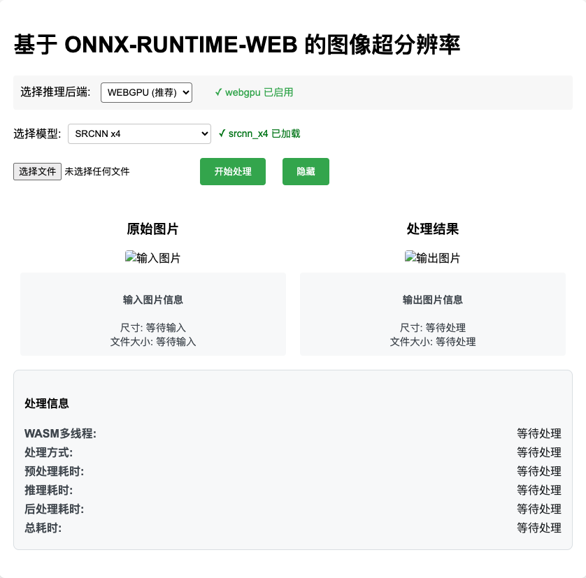
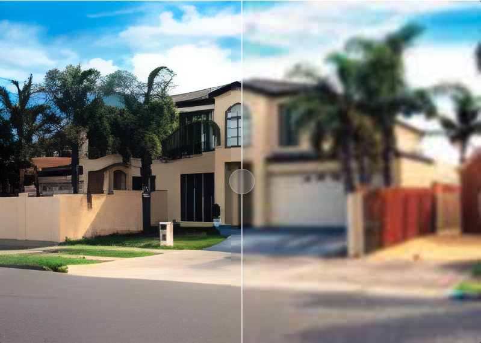

# SR-Inference-Web

[](https://github.com/CodeExplorerrrr/SR-Inference-Web)
[](./LICENSE)
[](https://v0-my-project-47hnf0zphqp.vercel.app/)
[](README.md)
[](README_CN.md)

---

## 🚀 Project Overview
A browser-based super-resolution inference tool that enhances image quality using AI models. This project allows users to upscale images directly in the web browser without needing to rely on server-side processing.

---

## ✨ Features
- **Real-time image super-resolution processing**  
- **Support for multiple image formats** (e.g., JPG, PNG)  
- **Runs entirely in the browser** with no server-side dependencies  
- Powered by **[SRCNN/Real-ESRGAN-x4plus/Real-ESRGAN-General-x4v3/RealESRGAN_x4plus_anime]** for AI inference  

---

## 🌟 Preview
  
  
  
---

## 📥 Installation & Usage

### 1. Clone the Repository  
Copy the following command to clone the project:
```bash
git clone https://github.com/CodeExplorerrrr/SR-Inference-Web.git
```

### 2. Install Dependencies  
Navigate to the project directory and install required dependencies:  
```bash
cd SR-Inference-Web
yarn
```

### 3. Run the Project  
Start the development server:  
```bash
yarn dev
```
Open your browser and go to [http://localhost:8000](http://localhost:8000) to view the project.

### 4.Choose Image and Inference

---

## 🛠️ Usage Instructions
1. Choose the appropriate backend and the inference model you want to use.
2. Upload an image you wish to upscale(If the image size is too large, the effect will be poor).
3. Click the "Start Inference" button to view the upscaled result.
4. After the processing is completed, you can see the effect and comparison of the generated images, and you can download them freely.

---

## 🧪 Testing
To run the test,follow these steps:

### 1. Before Run the test script
Run the Project:
```bash
yarn dev
```
### 1. End-to-end Testing
```bash
yarn test:e2e
```

### 2. Inference Effect Testing
```bash
yarn test:effect
```

### 3.Test tips:
-  Executing the end-to-end test will perform inference on the images in the tests/image_input folder in sequence, and save the results in the tests/image_output folder.
-  **It is not recommended to modify the test code and test images.** If modifications are necessary, do not pass in too large images, otherwise the inference time will be too long or the inference effect will be poor.
-  **The test is executed in the Chrome browser environment by default.** If you want to test other browsers, please modify the test script yourself and install the corresponding dependencies.

## 📦 Dependencies and Technology Stack
- **ONNX-RUNTIME-WEB**: For running the model inference in the browser  
- **JavaScript/HTML/CSS**: For building the frontend UI  
- **Vite**: Project packaging tool
- **Playwright**: For end-to-end (E2E) testing, simulating user interactions
- **PSNR/Sharp/SSIM**: Used for effect testing and image quality evaluation

---

## 📜 Model Information

### Models Used
This project supports multiple AI models for super-resolution inference:

1. **SRCNN**
    - Ideal for general image enhancement tasks.

2. **Real-ESRGAN-x4plus**
    - Provides high-quality upscaling for real-world images.

3. **Real-ESRGAN-General-x4v3**
    - Optimized for general-purpose image enhancement across a variety of inputs.

4. **RealESRGAN_x4plus_anime**
    - Specially designed for enhancing anime-style images.

### Download Links
These models are already included in the project [file](./models).

--- 

## 📄 License

This project is licensed under the [MIT License](./LICENSE) - see the LICENSE file for details.

### Model Licenses
This project utilizes the following pre-trained models. Each model is governed by its respective license:

1. **SRCNN Model**
   - **License**: MIT
   - **Source**: [SRCNN GitHub](https://github.com/tegg89/SRCNN-Tensorflow)

2. **Real-ESRGAN-x4plus**
   - **License**: BSD-3-Clause
   - **Source**: [Real-ESRGAN GitHub](https://github.com/xinntao/Real-ESRGAN)

3. **Real-ESRGAN-General-x4v3**
   - **License**: BSD-3-Clause
   - **Source**: [Real-ESRGAN GitHub](https://github.com/xinntao/Real-ESRGAN)

4. **RealESRGAN_x4plus_anime**
   - **License**: MIT
   - **Source**: [Real-ESRGAN Anime Huggingface](https://huggingface.co/xiongjie/lightweight-real-ESRGAN-anime)

### Usage Notes
- The **MIT License** applies to all original code in this repository.
- The pre-trained models included or referenced in this project are subject to their own licenses, as detailed above.
- Users are responsible for ensuring compliance with the terms of each model's license when using or redistributing this project.
---

## 🙏 Acknowledgments

Special thanks to **SenseTime** for their exceptional support and resources, and to the **Miaohua Team** for their professional assistance.

A special mention to **Zhou Haotian**, mentor from the Miaohua Team, for his invaluable guidance throughout the project.

Your contributions have been integral to the successful completion and high-quality delivery of this project. Thank you!

---


