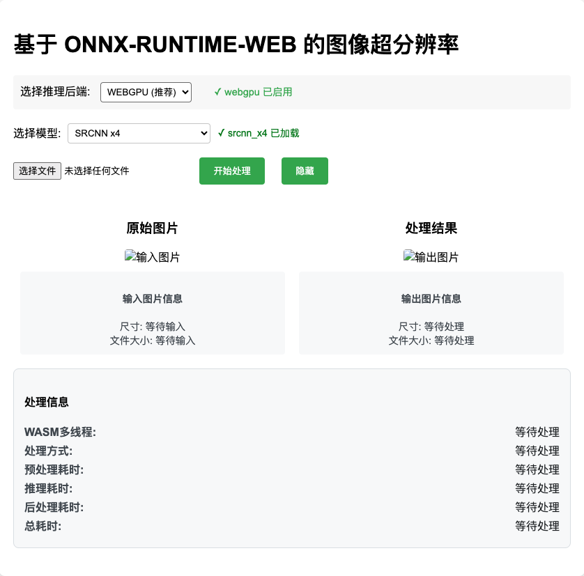
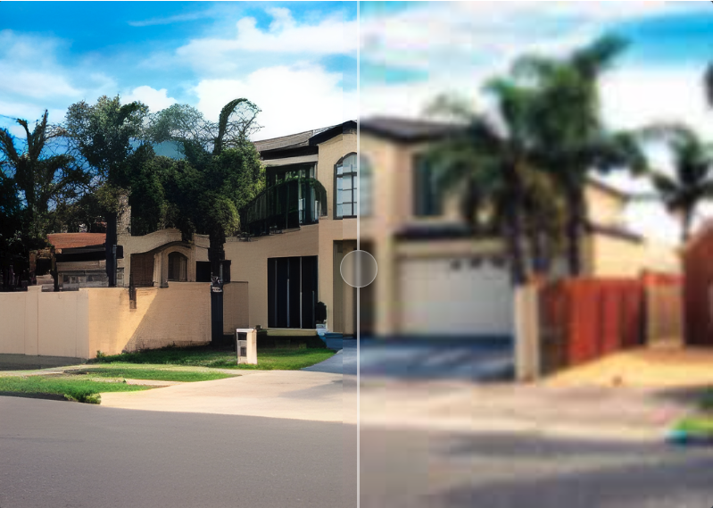
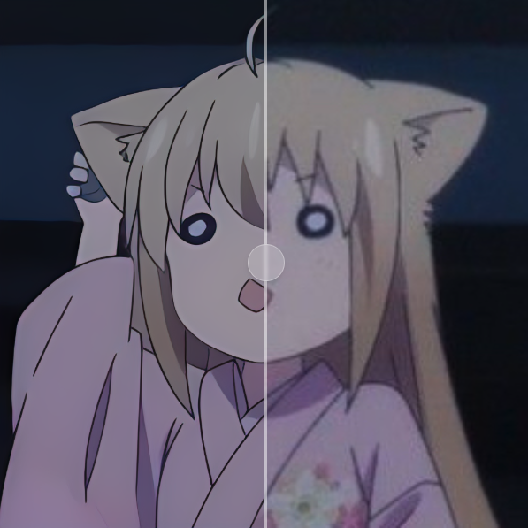

# SR-Inference-Web

[](https://github.com/CodeExplorerrrr/SR-Inference-Web)
[](./LICENSE)
[](https://v0-my-project-47hnf0zphqp.vercel.app/)
[](README.md)
[](README_CN.md)

---

## 🚀 项目概述
一个基于浏览器的超分辨率推理工具，使用 AI 模型提高图像质量。该项目允许用户在浏览器中直接进行图像放大，而无需依赖服务器端处理。

---

## ✨ 功能
- **实时图像超分辨率处理**  
- **支持多种图像格式**（如 JPG、PNG）  
- **完全在浏览器中运行**，无需服务器端依赖  
- 使用 **[SRCNN/Real-ESRGAN-x4plus/Real-ESRGAN-General-x4v3/RealESRGAN_x4plus_anime]** 进行 AI 推理  

---

## 🌟 预览
  
  
  

---

## 📥 安装与使用

### 1. 克隆项目仓库  
复制以下命令克隆项目：
```bash
git clone https://github.com/CodeExplorerrrr/SR-Inference-Web.git
```

### 2. 安装依赖
进入项目目录并安装所需依赖：
```bash
cd SR-Inference-Web
yarn
```

### 3. 运行项目
启动开发服务器：
```bash
yarn dev
```
在浏览器中打开 [http://localhost:8000](http://localhost:8000) 查看项目。

### 4. 选择图像并进行推理

---

## 🛠️ 使用说明
1. 选择适当的后端和推理模型。
2. 上传要放大的图像（如果图像尺寸过大，效果可能较差）。
3. 点击“开始推理”按钮查看放大结果。
4. 处理完成后，您可以查看生成图像的效果和对比，并可以自由下载。

---

## 🧪 测试
运行测试前，按照以下步骤操作：

### 1. 运行测试脚本之前
运行项目：
```bash
yarn dev
```
### 1. 端到端测试
```bash
yarn test:e2e
```

### 2. 推理效果测试
```bash
yarn test:effect
```

### 3. 测试提示：
- 执行端到端测试将对 `tests/image_input` 文件夹中的图像进行推理，并将结果保存在 `tests/image_output` 文件夹中。
- **不建议修改测试代码和测试图像。** 如果必须修改，请不要传入过大的图像，否则推理时间会过长或效果较差。
- **默认在 Chrome 浏览器环境下执行测试。** 如果要在其他浏览器中测试，请自行修改测试脚本并安装相应的依赖。

## 📦 依赖与技术栈
- **ONNX-RUNTIME-WEB**: 在浏览器中运行模型推理
- **JavaScript/HTML/CSS**: 用于构建前端 UI
- **Vite**: 项目打包工具
- **Playwright**: 用于端到端（E2E）测试，模拟用户交互
- **PSNR/Sharp/SSIM**: 用于效果测试和图像质量评估

---

## 📜 模型信息

### 使用的模型
本项目支持多个 AI 模型进行超分辨率推理：

1. **SRCNN**
    - 适用于一般图像增强任务。

2. **Real-ESRGAN-x4plus**
    - 为实际图像提供高质量的放大。

3. **Real-ESRGAN-General-x4v3**
    - 优化用于各种输入的通用图像增强。

4. **RealESRGAN_x4plus_anime**
    - 专为增强动漫风格图像设计。

### 下载链接
这些模型已包含在项目的 [文件](./models) 中。

---

## 📄 许可证

本项目采用 [MIT 许可证](./LICENSE) 许可 - 详情见 LICENSE 文件。

### 模型许可证
本项目使用了以下预训练模型，每个模型均由其各自的许可证管理：

1. **SRCNN 模型**
    - **许可证**: MIT
    - **来源**: [SRCNN GitHub](https://github.com/tegg89/SRCNN-Tensorflow)

2. **Real-ESRGAN-x4plus**
    - **许可证**: BSD-3-Clause
    - **来源**: [Real-ESRGAN GitHub](https://github.com/xinntao/Real-ESRGAN)

3. **Real-ESRGAN-General-x4v3**
    - **许可证**: BSD-3-Clause
    - **来源**: [Real-ESRGAN GitHub](https://github.com/xinntao/Real-ESRGAN)

4. **RealESRGAN_x4plus_anime**
    - **许可证**: MIT
    - **来源**: [Real-ESRGAN Anime Huggingface](https://huggingface.co/xiongjie/lightweight-real-ESRGAN-anime)

### 使用说明
- **MIT 许可证** 适用于本仓库中的所有原创代码。
- 本项目中包含或引用的预训练模型均受其各自许可证的约束，如上所述。
- 用户在使用或重新分发本项目时，需确保遵守每个模型许可证的条款。

---

## 🙏 鸣谢

特别感谢 **商汤科技** 提供的支持与资源，以及 **秒画团队** 和导师 **周皓天** 的专业指导！

你们的贡献为项目的顺利推进和高质量呈现提供了重要保障。衷心感谢！

---


